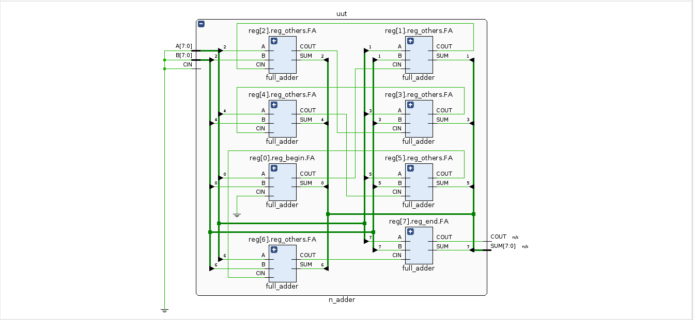
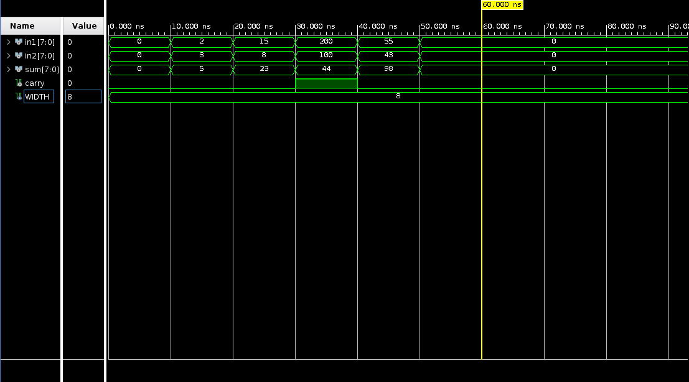
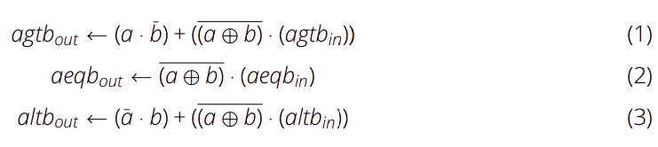
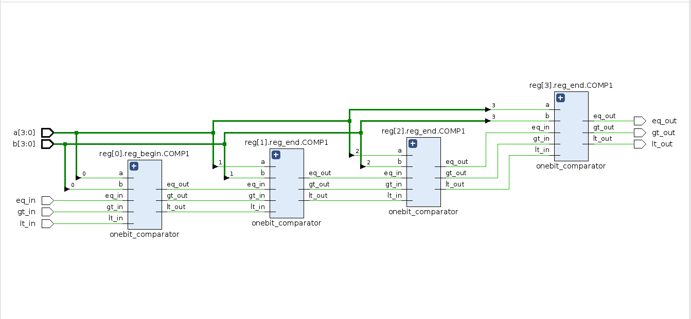
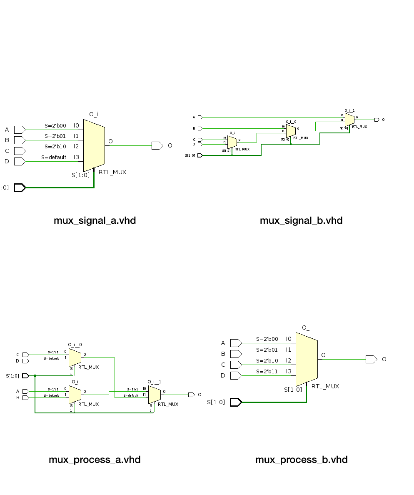
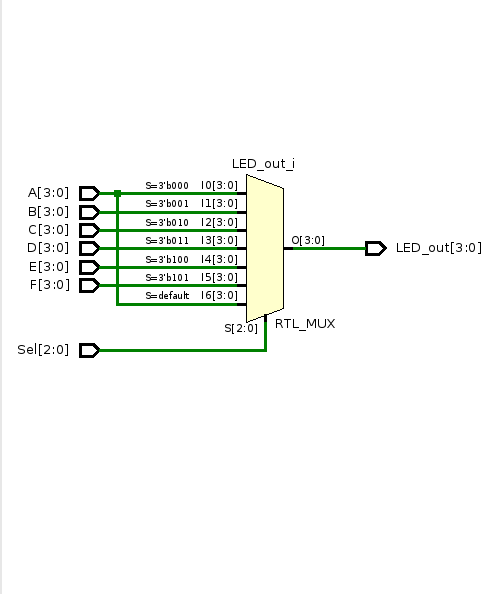

# Hardware Modelling & Simulation
Repo for the HMS class at TU Dresden

## Lab 1 - Structural Model I: Architecture, Entity, Components, Signals, Generics
### N-Bit Adder
This adder only uses Full Adders as components. The bit width of the adder is generic.

Using a test bench we can verify the behavior of the adder.

### N-Bit Comparator
A comparator circuit, as its name implies, compares binary words to check their equality. Some comparators interpret their inputs as numbers (with or without sign) and indicate an arithmetic relationship between them (greater than or less than, for example). Such circuits are called magnitude comparators.

We can cascade the 1-bit comparator to compare two 4-bit words (`A[3:0] and B[3:0]`). This new entity has, beside the inputs A and B, three outputs: greater than (`AGTBOUT`), less than (`ALTBOUT`) and equal to (`AEQBOUT`) and cascading inputs for comparing more than 4 bits (`AGTBIN, ALTBIN and AEQBIN`).

## Lab 2 - Structural Model II: Combinatorial Circuits, Multiplexer, Decoder, Process

### Multiplexer
Concurrent signal assignments: are one way to describe combinatorial logic within the body of the architecture. VHDL offers different types of concurrent signal assignments. You can describe as many concurrent statements as needed (see 2). The order of concurrent signal definition in the architecture is irrelevant. 

A process assigns values to signals in a different way. The values are assigned sequentially. The latest assignments can cancel previous ones. A combinatorial process has a sensitivity list appearing after the word process. The process is activated if an event (value change) appears on one of the sensitivity list signals. For a combinatorial process, this sensitivity list must contain all signals which appear in conditions (if, case, etc.), and any signal appearing on the right hand side of any assignment.

There are some differences in the schematics, although logically the output is the same. The reason lies in the way we describe the hardware on each method.

### LEDs Multiplexer

The final project needs a multiplexer for the LEDs. The signals A, B, C, D, E and F are for the each individual sevensegment digit in the PYNQ-shield of the lab

Sel | LED_out
----|--------
000 | A
001 | B
010 | C
011 | D
100 | E
101 | F

The truth table does not consider any other inputs past `101`, which should be taken into account to avoid undesired behavior.

###  Seven-Segment Decoder

The final project needs a decoder for the Seven-Segment display, to display the numbers of
the watch. The final watch will have six Seven-Segments.

BCD | Segments
----|---------
0000|1111110
0001|0110000
0010|1101101
0011|1111001
0100|0110011
0101|1011011
0110|1011111
0111|1110000
1000|1111111
1001|1111101
1010|1110111
1011|0011111
1100|1001110
1101|0111101
1110|1001111
1111|1000111

